*NOTE:* This file is a template that you can use to create the README for your project. The *TODO* comments below will highlight the information you should be sure to include.


# Project: Operationalizing Machine Learning

This project focuses on operationalizing machine learning using Azure ML. It involves two main use cases: deploying a bankmarketing model via an endpoint to perform predictions, and triggering AutoML training via an endpoint.
The process includes training a model using AutoML, deploying it for user interaction, and documenting its REST endpoint with Swagger.
Additionally, a training pipeline for AutoML is created, which can be triggered through a REST endpoint.
Both endpoints are tested using post requests.

## Architectural Diagram
*TODO*: Provide an architectual diagram of the project and give an introduction of each step. An architectural diagram is an image that helps visualize the flow of operations from start to finish. In this case, it has to be related to the completed project, with its various stages that are critical to the overall flow. For example, one stage for managing models could be "using Automated ML to determine the best model". 

### Bankmarketing Dataset
The dataset used in this project is from the domain of bankmarketing.
It contains data like the age, job and education of (potential) customers as well as other marketing related attributes.
For each person in the dataset there exists a decision variable "y" which is either "yes" or "no", which might represent a decision on whether a marketing campaign was sucessful with that person.

### Model training and deployment
The Model training and deployment consists of the following steps:

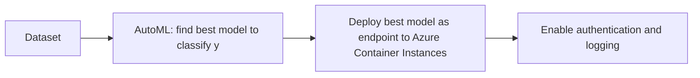
The diagram illustrates a process flow where a dataset - about bankmarketing in our case - is used as input to an AutoML run that finds the best model to classify the target variable, y which can be "yes" or "no". Once the best model is identified, it is then deployed to Azure Container Instances for use. Using the REST endpoint, a user can now authenticate and request a prediction from the deployed model. 
The user interaction with the model endpoint is illustrated below.

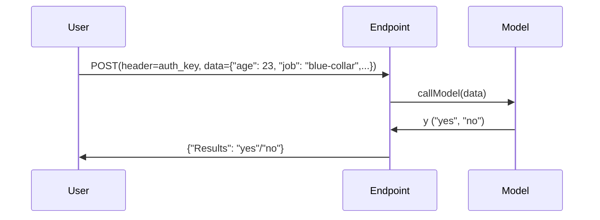

### Training Pipeline
Pipeline creation and publishing is outlined here:
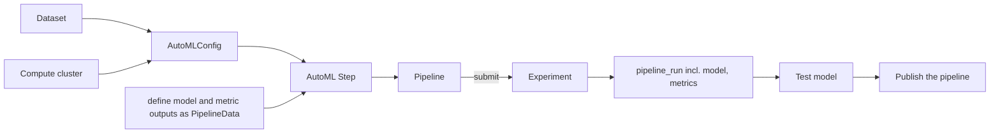
The pipeline in this project has a single AutoML step, which does the model training.
The AutoML step is defined using an AutoMLConfig, as well as desired output data (PipelineData).
The AutoMLConfig contains the information necessary to define how AutoML should run, for example the data set and the compute resource, but also things like exit criteria and the main performance metric.
When initially setting up the pipeline, we also test it by predicting the y variable from the dataset, creating a confusion matrix. This testing step is not part of the final pipeline.

After defining the pipeline as described above, the pipeline is submitted to an Experiment, which groups jobs in the Azure workspace used for the project. This submission, creates a pipeline run, meaning that the AutoML step is run by our compute resource.

Using this run, we then public the pipeline to create an endpoint pipeline training.
After publishing the pipeline, the pipeline can be run via its endpoint:

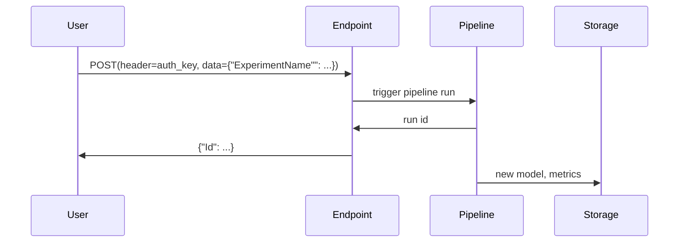

## Key Steps
*TODO*: Write a short discription of the key steps. Remeber to include all the screenshots required to demonstrate key steps. 

### Step 1: Autentication
Since we are working on automation and cannot trigger each machine learning task manually, we create a service principal.
A service principal is used to provide automated and authenticated access to Azure resources like compute and storage.

We use the az command line interface and specifically the "az role assignment command":
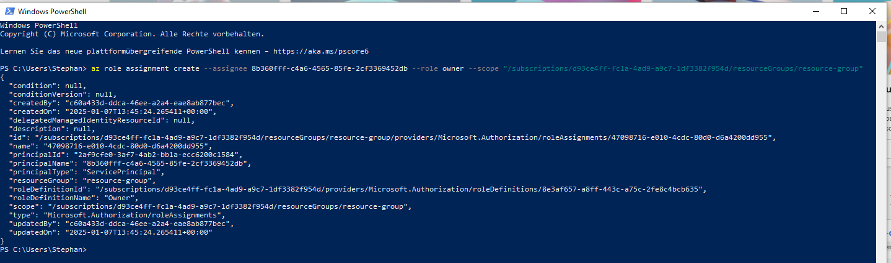
This command has replaced the older "az ml workspace share" which is now deprecated.

Here are details about the created service principal:
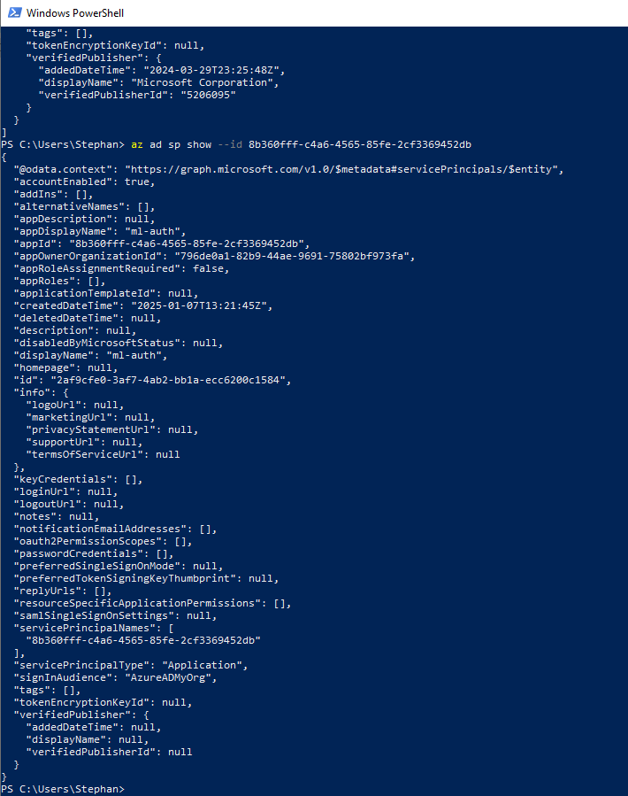

### Step 2: Automated ML experiment
To train the model for our bankmarketing use case, we first have to make the dataset available in our Azure ML workspace.
We upload the .csv file and get a first look that the content of the data.
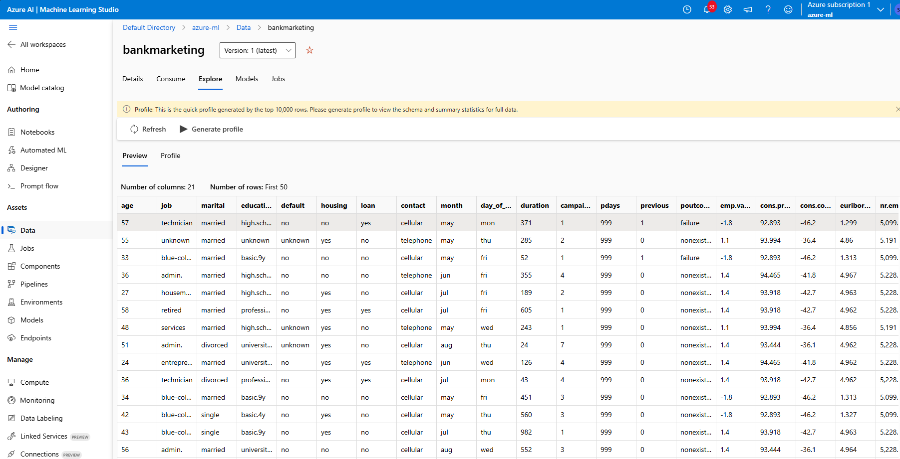

Next, we run an AutoML experiment on this dataset, optimizing the weighted area under the curve (AUC) metric.
After running the AutoML experiment, we can see the completion status and the best model selected.
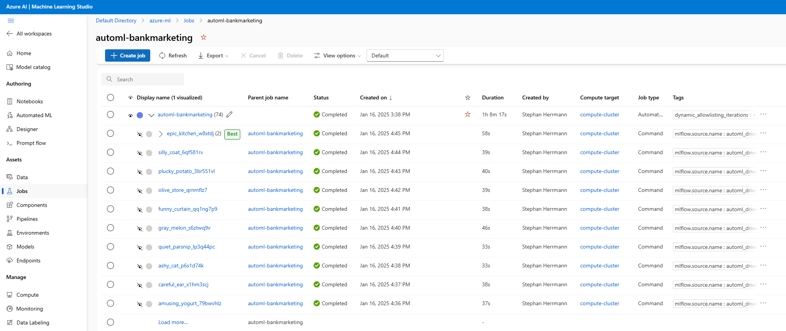

The best model identified by the AutoMLrun is a VotingEnsemble of several ensemble classifiers.
Under the Metrics tab, we can inspect the achieved performance characteristics of the model.
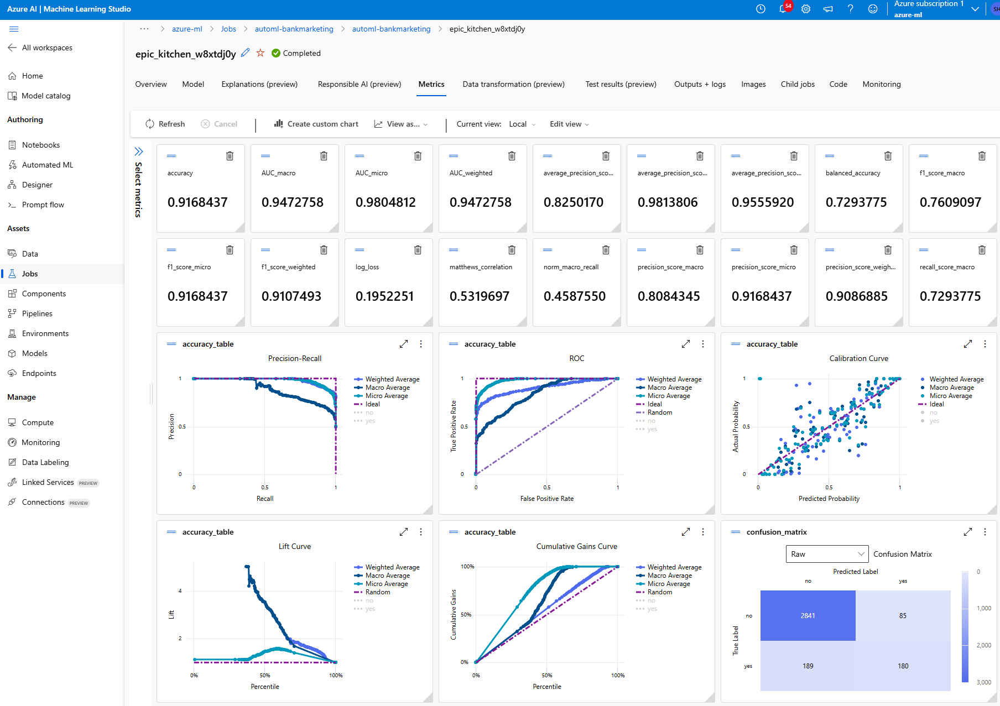

### Step 3: Deploy the best Model
I deployed the second best model found in the AutoML run (an XGBoost model), since it supports a no-code deployment to Azure Container Instances.
The best model (VotingEnsemble) does not support a no-code deployment, and instead requires to provide a scoring script.

### Step 4: Enable Logging
We enable logging by activation the so called Application Insights for our endpoint using the Azure SDK
```python
from azureml.core import Workspace
from azureml.core.webservice import Webservice

# Requires the config to be downloaded first to the current working directory
ws = Workspace.from_config()
name = "bankmarketing-deployment"
service = Webservice(name=name, workspace=ws)
service.update(enable_app_insights=True)
```

We can check the successful activation 
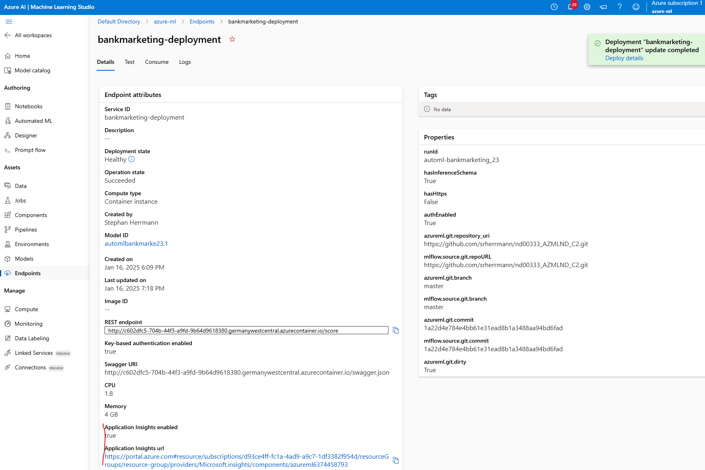

Logs are collected to provide insights into the model's performance and any issues that may arise during operation.
We collect the logs programmatically using the get_logs method of a Webservice object we create for our endpoint.
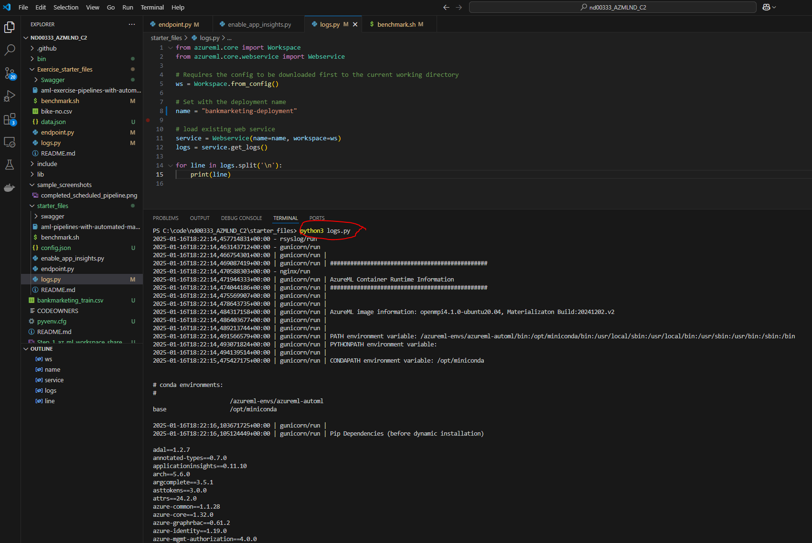

### Step 5: Swagger Documentation
Using Swagger, we can provide a detailed API documentation for the deployed model endpoint.
Swagger runs in a docker container and gets the documentation from a swagger.json file which can be accessed using the endpoint page in Azure ML Studio.
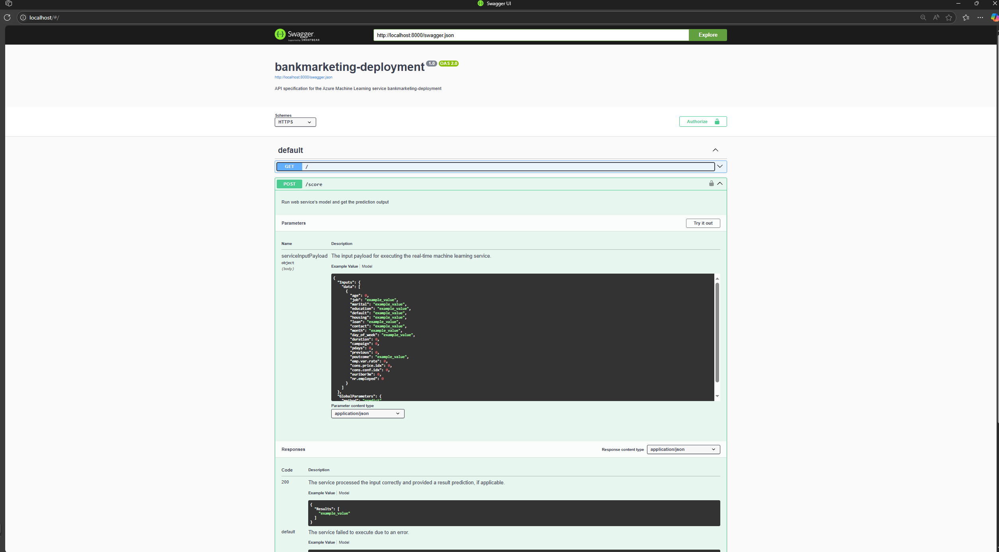

We can see that the endpoint API allows users to provide GET and POST requests to the endpoint.
As a response to the GET request, the endpoints sends its status to the user.
If a user provides a POST request, the model input data like age, job, etc. have to be provided for the model to make a prediction.
The response then contains the model prediction.

### Step 6: Consume Model Endpoints
Now we consume the model endpoint, by sending a POST request to the endpoint using python.
The python post request API uses the authentication key in the header data, the model input as payload and the URI of the endpoint.
In this example we send two model inputs and receive two prediction results, once "yes" and once "no".
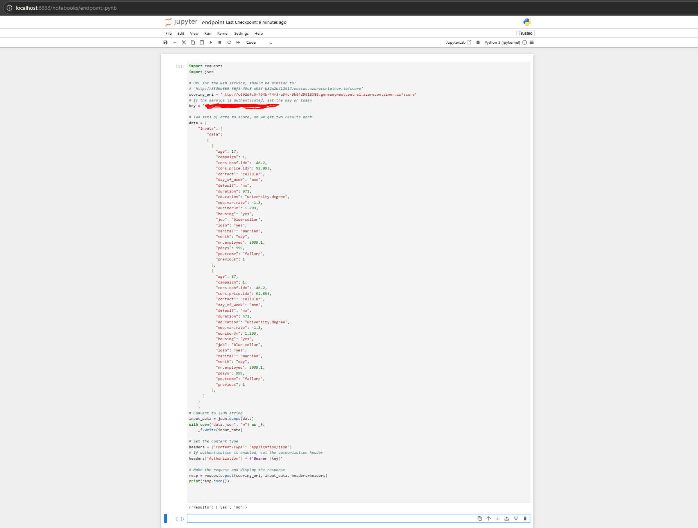

### Step 7: Create, Publish and Consume a Pipeline
To create, publish and consume a training pipeline, we again use the Azure SDK.
The pipeline is created using the `Pipeline` class that takes a description, our workspace and a list of pipeline steps.
In this project, a single AutoML step is used.
The pipeline is triggered using `pipeline_run = experiment.submit(pipeline)`.
The pipelines section in ML Studio shows the pipeline that was created.
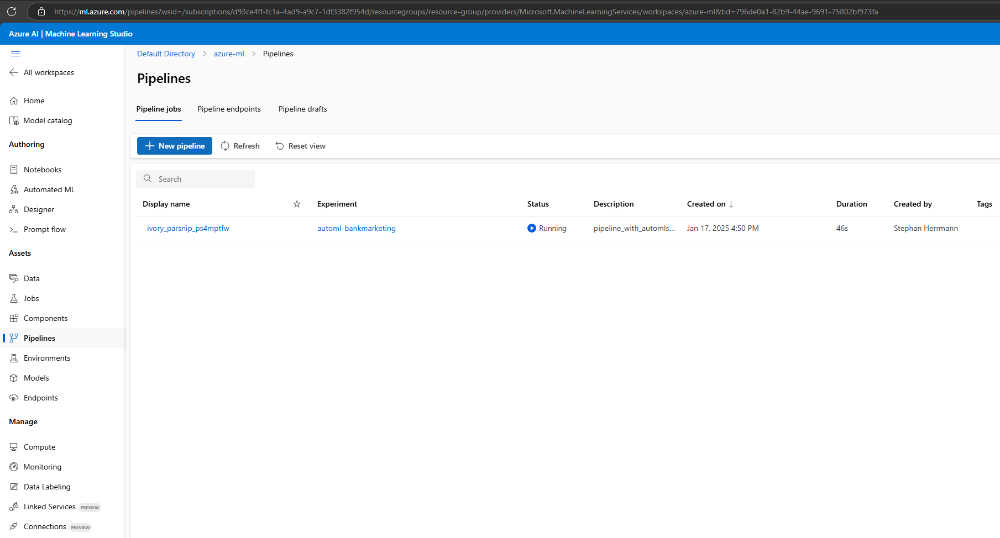

We can then publish this pipeline run to an endpoint using the method `pipeline_run.publish_pipeline(...)` which created and endpoint for the pipeline. The created pipeline endpoint is shown in the following image:
The pipeline endpoint is displayed in the ML Studio.
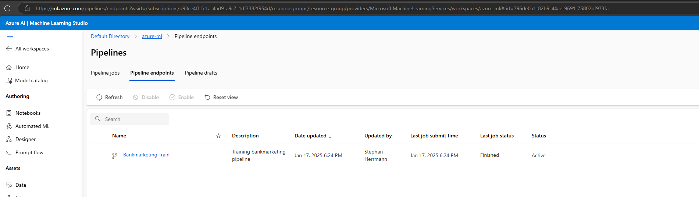

We can also show a visualization of the pipeline in Azure ML studio. In the following two images, we see the bankmarketing dataset and a pipeline run where the automl_module consumes the bankmarketing data.
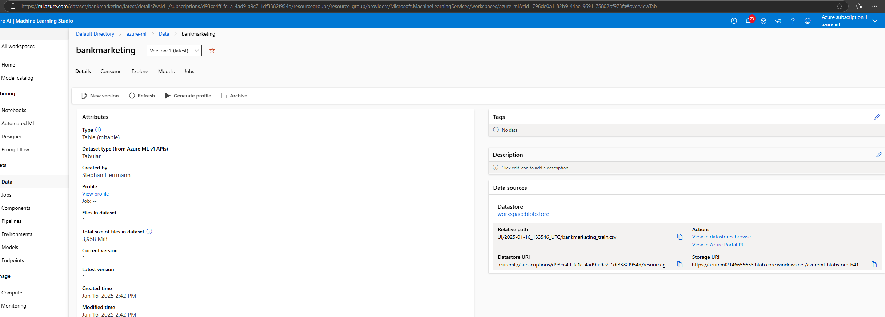
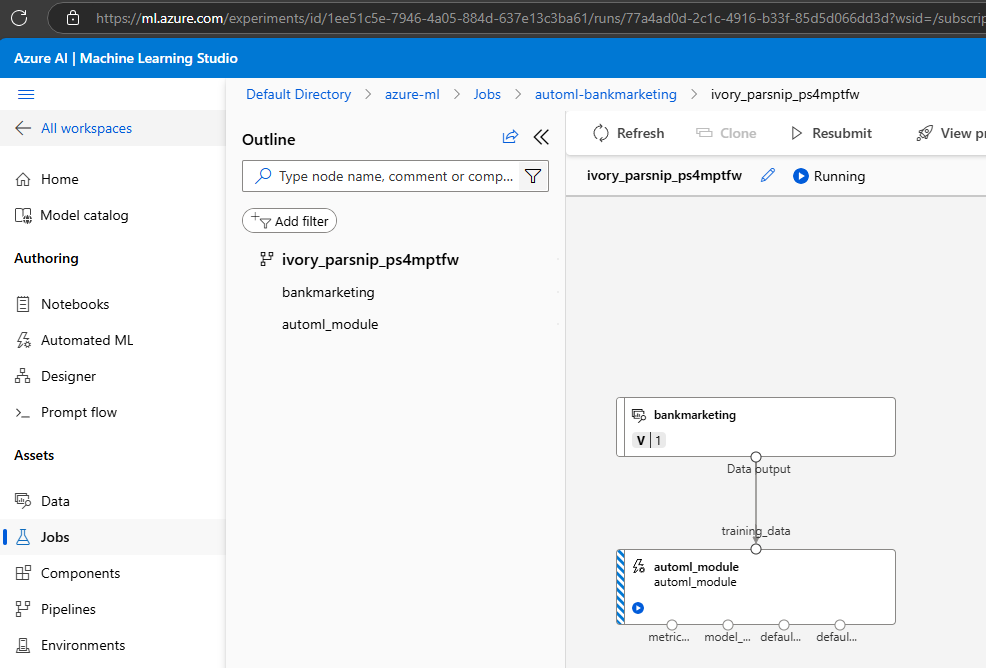

After publishing the pipeline, we can inspect its REST endpoint and see that it is active. To access this view we go to Pipelines -> Pipeline endpoints and then select our published pipeline.
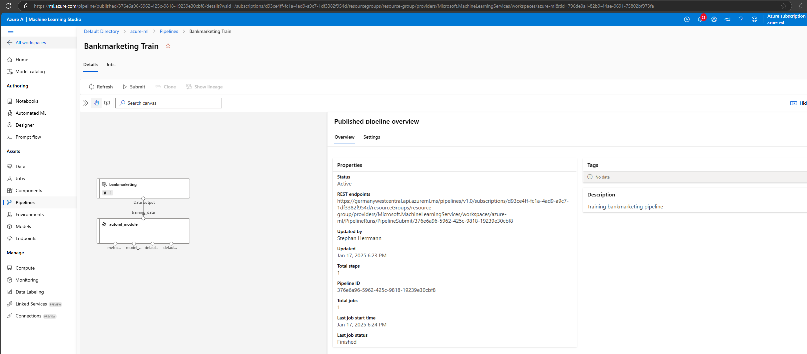

Now that we have published the pipeline, we can trigger pipeline runs using its REST endpoint.
To this end, we send a POSt request to the endpoint using the following code snippet
```python
import requests

rest_endpoint = published_pipeline.endpoint
response = requests.post(rest_endpoint, 
                         headers=auth_header, 
                         json={"ExperimentName": "pipeline-rest-endpoint"}
                        )
```
The rest_endpoint is the URI of the pipeline endpoint, the header contains the authentication key and the json payload has the experiment name.

We can get details about the triggered pipeline run directly in the notebook using the Azure SDK or in Azure ML Studio.
In the notebook, the Azure SDK v1 provides the RunDetails class to access run information.
However, we now got a deprecation warning.
To still access run details, we can use the ```get_details``` method of the pipeline run as shown in the following screenshot.
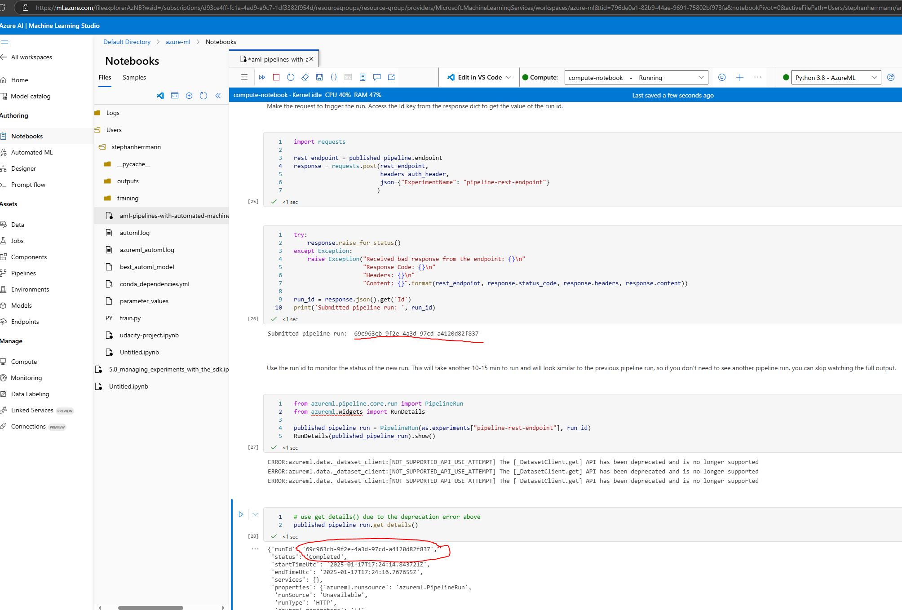

In Azure ML Studio, we can inspect details about pipeline runs via the Pipelines section.
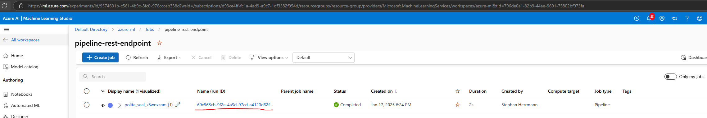
In this case, we see the pipeline job with the run ID that we got as a response from the pipeline endpoint, we can see its creation date and time as well as its status and, if desired, multiple other attributes.

## Screen Recording
https://vimeo.com/1048336344/709d8e398d?ts=0&share=copy